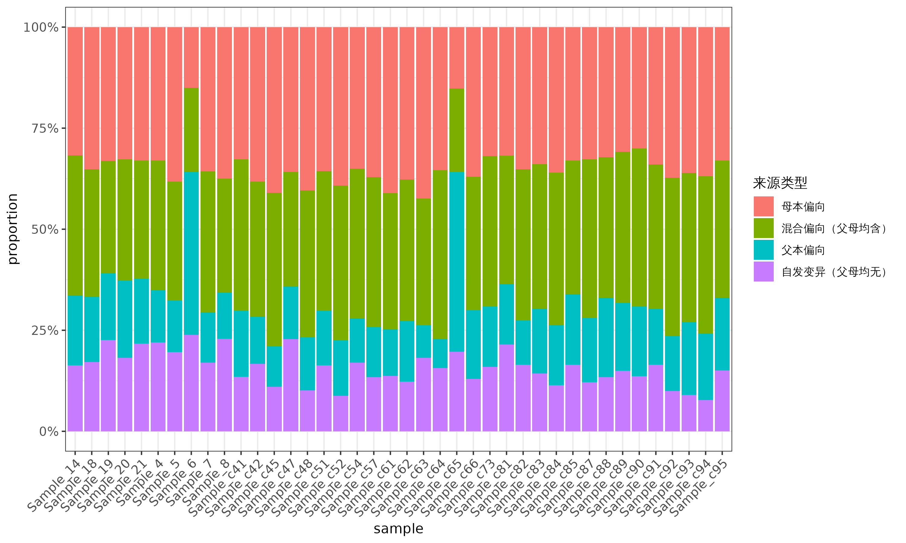

# Progeny Chloroplast Heterozygosity
Use Atha_cross(*Arabidopsis thaliana* Columbia X Ler) as example
## Basic info
* Genome: GCF_000001735.3, TAIR10, 119.668 Mb<br>
* Chloroplast: NC_000932, Columbia, 154478 bp<br>
* Chloroplast: KX551970, Landsberg erecta, 154515 bp<br> Ler-0，另一种常用野生型，与 Col-0 存在遗传差异
* Mitochondrion: Y08501, 366924 bp<br>
## Project
* https://www.pnas.org/content/109/51/20992.long<br>
* PRJNA178613<br>
## Download
* Reference
```
mkdir -p ~/data/plastid/Atha_cross/genome
cd ~/data/plastid/Atha_cross/genome

for ACCESSION in "NC_000932" "Y08501"; do
    URL=$(printf "https://eutils.ncbi.nlm.nih.gov/entrez/eutils/efetch.fcgi?db=nucleotide&rettype=%s&id=%s&retmode=text" "fasta" "${ACCESSION}");
    curl $URL -o ${ACCESSION}.fa
done

TAB=$'\t'
cat <<EOF > replace.tsv
NC_000932${TAB}Pt
Y08501${TAB}Mt
EOF

cat NC_000932.fa Y08501.fa |
    faops filter -s stdin stdout |
    faops replace stdin replace.tsv stdout |
    faops order stdin <(echo Pt; echo Mt) genome.fa
```
* illumina
    * Download Metadata from NCBI SRA Run Selector via a web browser
        * https://trace.ncbi.nlm.nih.gov/Traces/study/?acc=PRJNA178613
```
cat SraRunTable.csv |
    mlr --icsv --otsv cat |
    tsv-select -H -f Experiment,"Sample\ Name",Bases \
    > SraRunTable.tsv

cat SraRunTable.tsv |
    sed '1 s/^/#/' |
    keep-header -- tsv-sort -k2,2 -k3,3nr |
    tsv-uniq -H -f "Sample\ Name" --max 1 |
    mlr --itsv --ocsv cat \
    > source.csv

anchr ena info | perl - -v source.csv > ena_info.yml
anchr ena prep | perl - ena_info.yml --ascp

rgr md ena_info.tsv --fmt

cat ena_info.ascp.sh |
    parallel --no-run-if-empty -j 2 "{}"
```
## Symlink
```
cd ~/data/plastid/Atha_cross/

export FOLD=2
export GENOME_SIZE=$(
    cat ~/data/plastid/genome/col0/chr.sizes |
        tsv-summarize --sum 2
)

cat ena/ena_info.tsv |
    tsv-select -H -f name,srr,bases |
    perl -nla -F'\t' -e '
        BEGIN { our %seen }
        /^name/ and next;
        $seen{$F[0]} and next;
        my $bases = $F[2];
        $bases =~ s/G$//;
        my $cutoff = $bases * 1000 * 1000 * 1000 / $ENV{GENOME_SIZE} * $ENV{FOLD};
        $cutoff = int $cutoff;
        print join qq(\t), ($F[0], $F[1], $cutoff);
        $seen{$F[0]}++;
    ' \
    > opts.tsv

cat opts.tsv |
    parallel --colsep '\t' --no-run-if-empty --linebuffer -k -j 1 '
        if [ ! -f ena/{2}_1.fastq.gz ]; then
            exit;
        fi
        if [ ! -f ena/{2}_2.fastq.gz ]; then
            exit;
        fi

        if [ -f {1}.tar.gz ]; then
            exit;
        fi

        mkdir -p {1}/1_genome
        pushd {1}/1_genome

        cp ../../genome/genome.fa genome.fa
        popd > /dev/null

        mkdir -p {1}/2_illumina
        pushd {1}/2_illumina

        ln -fs ../../ena/{2}_1.fastq.gz R1.fq.gz
        ln -fs ../../ena/{2}_2.fastq.gz R2.fq.gz
        popd > /dev/null
    '
```
## Run anchr
```
cd Atha_cross
cat opts.tsv |
    parallel --colsep '\t' --no-run-if-empty --linebuffer -k -j 1 '
        if [ -f {1}.tar.gz ]; then
            exit;
        fi

        if [ ! -d {1} ]; then
            exit;
        fi

        if [ ! -e {1}/2_illumina/R1.fq.gz ]; then
            exit;
        fi
        if [ ! -e {1}/2_illumina/R2.fq.gz ]; then
            exit;
        fi

        if bjobs -w | tr -s " " | cut -d " " -f 7 | grep -w "^{1}$"; then
            echo Job {1} exists
            exit;
        fi

        cd {1}

        echo {1}

        rm *.sh
        anchr template \
            --genome 1000000 \
            --parallel 24 \
            --xmx 80g \
            \
            --fastqc \
            --insertsize \
            --fastk \
            \
            --trim "--dedupe --cutoff {3} --cutk 31" \
            --qual "25" \
            --len "60" \
            --filter "adapter artifact" \
            \
            --bwa Q25L60 \
            --gatk

        bsub -q mpi -n 24 -J "{1}" "
            bash 0_script/2_fastqc.sh
            bash 0_script/2_insert_size.sh
            bash 0_script/2_fastk.sh
            bash 0_script/2_trim.sh
            bash 0_script/9_stat_reads.sh
            bash 0_script/3_bwa.sh
            bash 0_script/3_gatk.sh
        "
    '
```
## calculate heterozygosity frequency
```
bash frequency.sh
./multi_sample_compare.sh /share/home/wangq/zxy/plastid/Atha_cross ./chloro_multi_stats
```
| 样本名       | 有效变异数 | 高频变异数（≥10%） | 中高频变异数（5%-10%） | 低频变异数（1%-5%） | 平均异质性频率（%） | 最高异质性频率（%） | 平均总reads数（×） | 最高频率位点（Pt:POS） |
|--------------|------------|--------------------|------------------------|--------------------|---------------------|---------------------|--------------------|------------------------|
| Sample_14 | 104 | 6 | 21 | 77 | 4.62 | 84.69 | 1513.5 | Pt:28672 |
| Sample_18 | 111 | 8 | 24 | 79 | 4.69 | 84.67 | 1437.8 | Pt:28672 |
| Sample_19 | 115 | 10 | 21 | 84 | 7.98 | 100.00 | 859.0 | Pt:136734 |
| Sample_20 | 110 | 6 | 26 | 78 | 4.53 | 84.19 | 1222.8 | Pt:28672 |
| Sample_21 | 106 | 4 | 27 | 75 | 4.63 | 84.63 | 1051.8 | Pt:28672 |
| Sample_4 | 100 | 6 | 21 | 73 | 5.51 | 100.00 | 954.7 | Pt:36321 |
| Sample_5 | 102 | 7 | 26 | 69 | 8.35 | 100.00 | 822.1 | Pt:136734 |
| Sample_6 | 193 | 8 | 39 | 146 | 4.00 | 81.46 | 2126.7 | Pt:28672 |
| Sample_7 | 112 | 10 | 17 | 85 | 8.30 | 100.00 | 1867.2 | Pt:136734 |
| Sample_8 | 96 | 9 | 14 | 73 | 8.62 | 100.00 | 670.9 | Pt:136734 |
| Sample_Col_G | 106 | 9 | 19 | 78 | 4.69 | 84.05 | 2619.9 | Pt:28672 |
| Sample_Ler_XL_4 | 266 | 91 | 36 | 139 | 30.49 | 100.00 | 5239.3 | Pt:4870 |
| Sample_c41 | 104 | 6 | 21 | 77 | 4.49 | 83.85 | 1717.3 | Pt:28672 |
| Sample_c42 | 102 | 9 | 20 | 73 | 4.77 | 81.92 | 1409.8 | Pt:28672 |
| Sample_c45 | 100 | 8 | 19 | 73 | 4.95 | 83.30 | 2163.1 | Pt:28672 |
| Sample_c47 | 92 | 6 | 16 | 70 | 4.69 | 85.96 | 773.7 | Pt:28672 |
| Sample_c48 | 99 | 8 | 18 | 73 | 4.77 | 85.14 | 1594.1 | Pt:28672 |
| Sample_c51 | 104 | 9 | 16 | 79 | 4.89 | 84.39 | 1625.3 | Pt:28672 |
| Sample_c52 | 102 | 7 | 13 | 82 | 4.49 | 87.40 | 1564.1 | Pt:28672 |
| Sample_c54 | 100 | 7 | 15 | 78 | 4.52 | 82.81 | 1276.6 | Pt:28672 |
| Sample_c57 | 97 | 6 | 16 | 75 | 4.50 | 83.96 | 1745.2 | Pt:28672 |
| Sample_c61 | 95 | 8 | 16 | 71 | 4.78 | 84.27 | 1606.9 | Pt:28672 |
| Sample_c62 | 106 | 6 | 19 | 81 | 4.51 | 84.35 | 1560.3 | Pt:28672 |
| Sample_c63 | 99 | 8 | 15 | 76 | 4.58 | 84.34 | 1445.2 | Pt:28672 |
| Sample_c64 | 96 | 7 | 15 | 74 | 4.62 | 84.32 | 1207.2 | Pt:28672 |
| Sample_c65 | 198 | 10 | 30 | 158 | 4.05 | 78.42 | 2000.1 | Pt:28672 |
| Sample_c66 | 100 | 9 | 17 | 74 | 5.17 | 84.58 | 2230.4 | Pt:28672 |
| Sample_c73 | 94 | 4 | 20 | 70 | 4.54 | 85.79 | 1374.9 | Pt:28672 |
| Sample_c81 | 107 | 8 | 21 | 78 | 4.65 | 83.00 | 1413.9 | Pt:28672 |
| Sample_c82 | 91 | 6 | 18 | 67 | 5.34 | 83.82 | 2006.1 | Pt:28672 |
| Sample_c83 | 112 | 9 | 17 | 86 | 4.63 | 82.83 | 2545.9 | Pt:28672 |
| Sample_c84 | 114 | 7 | 21 | 86 | 4.59 | 85.05 | 2067.3 | Pt:28672 |
| Sample_c85 | 109 | 7 | 18 | 84 | 4.77 | 84.99 | 2316.5 | Pt:28672 |
| Sample_c87 | 107 | 8 | 18 | 81 | 4.85 | 82.09 | 2039.6 | Pt:28672 |
| Sample_c88 | 112 | 10 | 17 | 85 | 4.96 | 83.66 | 2336.7 | Pt:28672 |
| Sample_c89 | 107 | 8 | 19 | 80 | 4.76 | 83.43 | 1743.7 | Pt:28672 |
| Sample_c90 | 110 | 9 | 16 | 85 | 4.78 | 85.34 | 2493.4 | Pt:28672 |
| Sample_c91 | 109 | 10 | 20 | 79 | 5.12 | 81.59 | 2433.9 | Pt:28672 |
| Sample_c92 | 110 | 8 | 17 | 85 | 4.65 | 82.75 | 1914.9 | Pt:28672 |
| Sample_c93 | 111 | 8 | 19 | 84 | 4.58 | 82.15 | 1719.8 | Pt:28672 |
| Sample_c94 | 103 | 9 | 13 | 81 | 4.55 | 85.02 | 3791.4 | Pt:28672 |
| Sample_c95 | 106 | 9 | 18 | 79 | 4.63 | 83.70 | 3651.7 | Pt:28672 |

```R
#!/usr/bin/env Rscript

# ===============================
# 🌿 Plastid 异质性来源比例统计
# ===============================

library(dplyr)
library(ggplot2)
library(readr)
library(scales)

# -------------------------------
# 基本路径设置
# -------------------------------
workdir <- "/share/home/wangq/zxy/plastid/Atha_cross"

# 获取所有子代样本（排除父母与混合样本）
all_samples <- list.dirs(workdir, full.names = FALSE, recursive = FALSE)
exclude_samples <- c("Sample_Col_G", "Sample_Ler_XL_4",
                     "Sample_l2c2", "Sample_l2l3",
                     "Sample_l4c1", "Sample_l4l3", "Sample_c1c2")
samples <- setdiff(all_samples, exclude_samples)

cat("有效子代样本数:", length(samples), "\n")

# -------------------------------
# 读取并合并所有样本数据
# -------------------------------
all_stats <- data.frame()

for (sample in samples) {
  infile <- file.path(workdir, sample, "chloroplast_hetero_parent_ratio.txt")

  if (!file.exists(infile)) {
    cat("⚠️ 文件不存在，跳过:", infile, "\n")
    next
  }

  df <- read.delim(infile, header = TRUE, stringsAsFactors = FALSE, check.names = FALSE)

  if (nrow(df) == 0) {
    cat("⚠️ 文件为空，跳过:", infile, "\n")
    next
  }

  df$Sample <- sample
  all_stats <- bind_rows(all_stats, df)
}

if (nrow(all_stats) == 0) {
  stop("❌ 没有有效数据可统计，请检查输入文件！")
}

# -------------------------------
# 清洗“来源判断”列
# -------------------------------
all_stats$来源判断 <- gsub("（.*", "", all_stats$来源判断)  # 去掉括号及后面的文字
all_stats$来源判断 <- gsub("🧬", "", all_stats$来源判断)    # 去掉emoji
all_stats$来源判断 <- trimws(all_stats$来源判断)            # 去掉多余空格

# -------------------------------
# 统计每类来源的 reads 总和与比例
# -------------------------------
summary_stats <- all_stats %>%
  group_by(Sample, 来源判断) %>%
  summarise(total_reads = sum(`总reads数`, na.rm = TRUE), .groups = "drop") %>%
  group_by(Sample) %>%
  mutate(sum_reads = sum(total_reads, na.rm = TRUE)) %>%
  mutate(proportion = ifelse(sum_reads > 0, total_reads / sum_reads, NA)) %>%
  ungroup()

# -------------------------------
# 汇总比例表
# -------------------------------
report <- summary_stats %>%
  group_by(Sample) %>%
  summarise(
    母本 = round(sum(proportion[来源判断 == "母本"], na.rm = TRUE), 3),
    父本 = round(sum(proportion[来源判断 == "父本"], na.rm = TRUE), 3),
    混合 = round(sum(proportion[来源判断 == "混合"], na.rm = TRUE), 3),
    自发突变 = round(sum(proportion[来源判断 == "自发变异"], na.rm = TRUE), 3)
  ) %>%
  mutate(总和 = 母本 + 父本 + 混合 + 自发突变)

# -------------------------------
# 输出表格
# -------------------------------
out_table <- file.path(workdir, "chloroplast_hetero_summary.csv")
write.csv(report, out_table, row.names = FALSE)
cat("✅ 已保存结果表:", out_table, "\n")

# -------------------------------
# 绘制堆积柱状图
# -------------------------------
summary_stats$来源判断 <- factor(
  summary_stats$来源判断,
  levels = c("母本", "父本", "混合", "自发变异")
)

p <- ggplot(summary_stats, aes(x = Sample, y = proportion, fill = 来源判断)) +
  geom_bar(stat = "identity") +
  scale_y_continuous(labels = scales::percent, limits = c(0, 1)) +
  labs(
    title = "叶绿体异质性来源 reads 占比统计",
    x = "样本",
    y = "reads 占比",
    fill = "来源类型"
  ) +
  theme_bw() +
  theme(
    axis.text.x = element_text(angle = 45, hjust = 1, size = 9),
    axis.text.y = element_text(size = 10),
    plot.title = element_text(hjust = 0.5, face = "bold"),
    legend.position = "top"
  )

out_plot <- file.path(workdir, "chloroplast_hetero_summary_plot.png")
ggsave(out_plot, p, width = 12, height = 6, dpi = 300)


```

## calculate the proportion of sources for variant sites
* find parents' GT difference
```
mkdir -p analysis
cd analysis

#提取亲本
cp ../Sample_Col_G/3_gatk/R.filtered.vcf Col.vcf
cp ../Sample_Ler_XL_4/3_gatk/R.filtered.vcf Ler.vcf

bgzip Col.vcf Ler.vcf

bcftools view --apply-filters PASS --max-alleles 2 --targets Pt  --include "AF>0.01" -Oz Col.vcf.gz > Col_Pt.vcf.gz
bcftools view --apply-filters PASS --max-alleles 2 --targets Pt  --include "AF>0.01" -Oz Ler.vcf.gz > Ler_Pt.vcf.gz
bcftools index Col_Pt.vcf.gz
bcftools index Ler_Pt.vcf.gz

#亲本差异位点
bcftools reheader -s <(echo "Col") Col_Pt.vcf.gz -o Col_Pt.renamed.vcf.gz
bcftools reheader -s <(echo "Ler") Ler_Pt.vcf.gz -o Ler_Pt.renamed.vcf.gz
bcftools index Col_Pt.renamed.vcf.gz
bcftools index Ler_Pt.renamed.vcf.gz

bcftools merge -m all Col_Pt.renamed.vcf.gz Ler_Pt.renamed.vcf.gz -Oz -o Col_Ler.merged.vcf.gz
bcftools index Col_Ler.merged.vcf.gz

bcftools query -f '%CHROM\t%POS\t%REF\t%ALT\t[%GT\t]\n' Col_Ler.merged.vcf.gz > Col_Ler_GT.tsv
perl -ane 'print if $F[4] ne $F[5]' Col_Ler_GT.tsv > different_sites.tsv
```
* extract progeny GT
```
cd ..
mkdir -p vcf
cat opts.tsv |
    parallel --colsep '\t' --no-run-if-empty --linebuffer -k -j 4 '
        if [ ! -d "{1}" ] || [ ! -f "{1}/3_gatk/R.filtered.vcf" ]; then
            echo "样本 {1} 文件缺失，跳过"
            continue
        fi

        echo "处理样本: {1}"
        
        # 处理VCF：重命名样本、筛选Pt、过滤PASS、双等位基因、最小AF
        bcftools reheader --samples <(echo {1}) "{1}/3_gatk/R.filtered.vcf" |
            bcftools view \
                --apply-filters PASS \
                --max-alleles 2 \
                --targets Pt \
                -Oz |
            bcftools view --include "AF>0.01" -Oz -o vcf/{1}.vcf.gz

        # 索引VCF
        bcftools index -f vcf/{1}.vcf.gz
    '

bcftools merge --merge all -l <(
        cat opts.tsv |
            cut -f 1 |
            grep -Ev "^Sample_Col_G$|^Sample_Ler_XL_4$" |
            parallel -k -j 1 ' [ -f vcf/{}.vcf.gz ] && echo "vcf/{}.vcf.gz" '
    ) \
    > Atha_cross.vcf

bcftools stats Atha_cross.vcf > Atha_cross.stats
plot-vcfstats  Atha_cross.stats  -p  plots/Atha_cross.stats

cd analysis
bgzip ../Atha_cross.vcf
bcftools index -f ../Atha_cross.vcf.gz

#与父母本比较
bcftools view -R <(cut -f1,2 different_sites.tsv) ../Atha_cross.vcf.gz -Oz -o F2_informative.vcf.gz

#排除Mt\Nc中的相似性位点
cp ~/data/plastid/genome/col0/genome.fa .
faops some genome.fa <(echo 1; echo 2; echo 3; echo 4; echo 5) chr.fa
faops some genome.fa <(echo Pt) Pt.fa
faops some genome.fa <(echo Mt) Mt.fa

bwa index chr.fa
bwa index Mt.fa
bwa index Pt.fa

bwa mem -t 8 chr.fa Pt.fa | samtools sort -o Pt_vs_nuclear.bam
bwa mem -t 8 Mt.fa Pt.fa  | samtools sort -o Pt_vs_mt.bam

bedtools bamtobed -i Pt_vs_nuclear.bam > Pt_vs_nuclear.bed
bedtools bamtobed -i Pt_vs_mt.bam > Pt_vs_mt.bed
cat Pt_vs_nuclear.bed Pt_vs_mt.bed | bedtools sort -i - | bedtools merge -i - > Pt_homology.bed
bcftools view -T ^Pt_homology.bed F2_informative.vcf.gz -Oz -o F2_filtered_homology.vcf.gz
bcftools index -f F2_filtered_homology.vcf.gz
```
* data filtering and processing
```
#稀有位点过滤 (<10% 样本)
bcftools query -f '%CHROM\t%POS[\t%GT]\n' F2_filtered_homology.vcf.gz |
perl -F'\t' -ane '
    $total_samples = '$(cat opts_no_parents.tsv | wc -l)';
    $count_alt = 0;
    $total = 0;
    for ($i = 2; $i < @F; $i++) {
        if ($F[$i] ne "./.") {
            $total++;
            $count_alt++ if $F[$i] =~ /1/;
        }
    }
    if ($total > 0 && $count_alt / $total >= 0.1) {
        print join("\t", @F[0,1]), "\n";
    }
' > common_sites.txt
bcftools view -R common_sites.txt F2_filtered_homology.vcf.gz -Oz -o F2_common.vcf.gz
bcftools index -f F2_common.vcf.gz


#成簇位点过滤 (<50bp)
# 提取并转换位点
bcftools query -f '%CHROM\t%POS\n' F2_common.vcf.gz | \
perl -ane 'print "$F[0]\t" . ($F[1] - 1) . "\t$F[1]\n"' > sites.bed

# 排序和聚类
bedtools sort -i sites.bed | \
bedtools cluster -d 50 -i - > clustered.bed

#处理聚类结果
perl -ane '
    $cluster_count{$F[3]}++;
    push @{$cluster_info{$F[3]}}, [$F[0], $F[2]];
    END {
        foreach $cluster_id (sort { $a <=> $b } keys %cluster_count) {
            if ($cluster_count{$cluster_id} == 1) {
                my $site = $cluster_info{$cluster_id}[0];
                print "$site->[0]\t$site->[1]\n";
            }
        }
    }
' clustered.bed > nonclustered_chrom_pos.txt

bcftools view -R nonclustered_chrom_pos.txt F2_common.vcf.gz -Oz -o F2_noncluster.vcf.gz
bcftools index -f F2_noncluster.vcf.gz


#排除测序或者 PCR 的偏向性错误（单碱基重复±2bp过滤）
grep -v "^>" Pt.fa | tr -d '\n' > Pt.seq.txt

perl -ne '
    while (/(A{5,}|T{5,}|C{5,}|G{5,})/g) {
        $start = $-[0];
        $end   = $+[0]; 
        print "Pt\t$start\t$end\n";
    }
' Pt.seq.txt > homopolymer.bed
samtools faidx Pt.fa
bedtools slop -i homopolymer.bed -g Pt.fa.fai -b 2 > homopolymer_plus2.bed
bcftools view -T ^homopolymer_plus2.bed F2_noncluster.vcf.gz -Oz -o F2_highconf.vcf.gz
bcftools index -f F2_highconf.vcf.gz

# 提取 GT 矩阵（基于高置信度 VCF）
bcftools query -f '%CHROM\t%POS\t[%GT\t]\n' F2_highconf.vcf.gz > F2_GT_matrix.tsv

grep -v -E '^Sample_Col_G|^Sample_Ler_XL_4|^Sample_c1c2|^Sample_l2c2|^Sample_l2l3|^Sample_l4c1|^Sample_l4l3' ../opts.tsv > opts_no_parents.tsv
echo -e "CHROM\tPOS\t$(cat opts_no_parents.tsv | cut -f1 | paste -sd '\t' -)" > header.txt
cat header.txt F2_GT_matrix.tsv > F2_GT_matrix_with_header.tsv

bcftools query -f '%CHROM\t%POS\n' F2_highconf.vcf.gz > highconf_sites.list

perl -F'\s+' -ane '
    BEGIN {
        open my $fh, "<", "highconf_sites.list" or die $!;
        while (<$fh>) {
            chomp;
            my @f = split /\s+/;
            $seen{"$f[0]:$f[1]"} = 1;
        }
        close $fh;
    }
    $key = "$F[0]:$F[1]";
    print if $seen{$key};
' different_sites_with_len.tsv > different_sites_with_len_highconf_perl.tsv

perl -F'\t' -ane '
    BEGIN {
        open my $fh, "<", "highconf_sites.list" or die $!;
        while (<$fh>) {
            chomp;
            $seen{$_} = 1;
        }
        close $fh;
    }
    $key = "$F[0]:$F[1]";
    print if $seen{$key};
' F2_sites_ref_alt.tsv > F2_sites_ref_alt_highconf_perl.tsv
```
* calculate the proportion
```
GENOME_SIZE=154478
total_samples=$(cat opts_no_parents.tsv | wc -l)
current=1

> sample_ratio_tmp.tsv
cat opts_no_parents.tsv | while read -r line; do
    sample=$(echo "$line" | cut -f1)
    target_col=$((current + 2))

    echo "[$current/$total_samples] 正在处理样本 $sample，列号 $target_col"

    sample="$sample" target_col="$target_col" GENOME_SIZE="$GENOME_SIZE" \
    perl -F'\t' -ane '
        BEGIN {
            $sample     = $ENV{"sample"};
            $target_col = $ENV{"target_col"};
            $genome_size= $ENV{"GENOME_SIZE"};

            # 父母差异位点长度
            open my $fh1, "<", "different_sites_with_len_highconf.tsv" or die $!;
            while (<$fh1>) {
                chomp;
                my @f = split /\t/;
                my $key = "$f[0]:$f[1]";
                $col_gt{$key}  = $f[4];
                $ler_gt{$key}  = $f[5];
                $site_len{$key}= $f[6];
            }
            close $fh1;

            # F2位点长度
            open my $fh2, "<", "F2_sites_ref_alt_highconf.tsv" or die $!;
            while (<$fh2>) {
                chomp;
                my @f = split /\t/;
                my $key = "$f[0]:$f[1]";
                my $len_ref = length($f[2]);
                my $len_alt = length($f[3]);
                $f2_len{$key} = ($len_ref == $len_alt) ? $len_ref : abs($len_ref - $len_alt);
            }
            close $fh2;

            $count_col = $count_ler = $count_mut = $total = 0;
            $len_col = $len_ler = $len_mut = 0;
        }

        next if $. == 1;   # 跳过header

        my $key = "$F[0]:$F[1]";
        my $gt  = $F[$target_col - 1];
        my $col = $col_gt{$key};
        my $ler = $ler_gt{$key};

        my $this_len = exists $site_len{$key} ? $site_len{$key} : $f2_len{$key};
        next if $gt eq "./.";

        if ($gt eq $col) {
            $count_col++; $len_col += $this_len;
        } elsif ($gt eq $ler) {
            $count_ler++; $len_ler += $this_len;
        } else {
            $count_mut++; $len_mut += $this_len;
        }
        $total++;

        END {
            if ($total > 0 && $genome_size > 0) {
                my $col_ratio = $count_col / $total * 100;
                my $ler_ratio = $count_ler / $total * 100;
                my $mut_ratio = $count_mut / $total * 100;

                my $col_genome = $len_col / $genome_size * 100;
                my $ler_genome = $len_ler / $genome_size * 100;
                my $mut_genome = $len_mut / $genome_size * 100;

                printf("%s\t%.4f\t%.6f\t%.4f\t%.6f\t%.4f\t%.6f\t%d\t%d\t%d\t%d\t%d\t%d\n",
                    $sample, $col_ratio, $col_genome,
                    $ler_ratio, $ler_genome, $mut_ratio, $mut_genome,
                    $count_col, $count_ler, $count_mut,
                    $len_col, $len_ler, $len_mut);
            } else {
                printf("%s\t0\t0\t0\t0\t0\t0\t0\t0\t0\t0\t0\t0\n", $sample);
            }
        }
    ' F2_GT_matrix_with_header.tsv >> sample_ratio_tmp.tsv

    current=$((current + 1))
done

echo -e "Sample\tColRatio\tColGenome\tLerRatio\tLerGenome\tMutRatio\tMutGenome\tColCount\tLerCount\tMutCount\tColLength\tLerLength\tMutLength" > sample_ratio_summary.tsv
cat sample_ratio_tmp.tsv >> sample_ratio_summary.tsv

echo -e "| 样本名称 | Col型比例(%) | Col基因组占比(%) | Ler型比例(%) | Ler基因组占比(%) | Mut型比例(%) | Mut基因组占比(%) | Col型位点数 | Ler型位点数 | Mut型位点数 | Col长度 | Ler长度 | Mut长度 |" > sample_ratio_summary.md
echo -e "| --- | --- | --- | --- | --- | --- | --- | --- | --- | --- | --- | --- | --- |" >> sample_ratio_summary.md

tail -n +2 sample_ratio_summary.tsv | awk -F'\t' '{
    printf("| %s | %s | %s | %s | %s | %s | %s | %d | %d | %d | %d | %d | %d |\n", \
        $1, $2, $3, $4, $5, $6, $7, $8, $9, $10, $11, $12, $13);
}' >> sample_ratio_summary.md

```
| 样本名称 | Col型比例(%) | Col基因组占比(%) | Ler型比例(%) | Ler基因组占比(%) | Mut型比例(%) | Mut基因组占比(%) | Col型位点数 | Ler型位点数 | Mut型位点数 | Col长度 | Ler长度 | Mut长度 |
| --- | --- | --- | --- | --- | --- | --- | --- | --- | --- | --- | --- | --- |
| Sample_14 | 100.0000 | 0.001942 | 0.0000 | 0.000000 | 0.0000 | 0.000000 | 3 | 0 | 0 | 3 | 0 | 0 |
| Sample_18 | 100.0000 | 0.002589 | 0.0000 | 0.000000 | 0.0000 | 0.000000 | 4 | 0 | 0 | 4 | 0 | 0 |
| Sample_19 | 100.0000 | 0.001942 | 0.0000 | 0.000000 | 0.0000 | 0.000000 | 3 | 0 | 0 | 3 | 0 | 0 |
| Sample_20 | 100.0000 | 0.001295 | 0.0000 | 0.000000 | 0.0000 | 0.000000 | 2 | 0 | 0 | 2 | 0 | 0 |
| Sample_21 | 100.0000 | 0.000647 | 0.0000 | 0.000000 | 0.0000 | 0.000000 | 1 | 0 | 0 | 1 | 0 | 0 |
| Sample_4 | 100.0000 | 0.001942 | 0.0000 | 0.000000 | 0.0000 | 0.000000 | 3 | 0 | 0 | 3 | 0 | 0 |
| Sample_5 | 100.0000 | 0.001942 | 0.0000 | 0.000000 | 0.0000 | 0.000000 | 3 | 0 | 0 | 3 | 0 | 0 |
| Sample_6 | 0 | 0 | 0 | 0 | 0 | 0 | 0 | 0 | 0 | 0 | 0 | 0 |
| Sample_7 | 100.0000 | 0.001942 | 0.0000 | 0.000000 | 0.0000 | 0.000000 | 3 | 0 | 0 | 3 | 0 | 0 |
| Sample_8 | 100.0000 | 0.001295 | 0.0000 | 0.000000 | 0.0000 | 0.000000 | 2 | 0 | 0 | 2 | 0 | 0 |
| Sample_c41 | 100.0000 | 0.001942 | 0.0000 | 0.000000 | 0.0000 | 0.000000 | 3 | 0 | 0 | 3 | 0 | 0 |
| Sample_c42 | 100.0000 | 0.002589 | 0.0000 | 0.000000 | 0.0000 | 0.000000 | 4 | 0 | 0 | 4 | 0 | 0 |
| Sample_c45 | 66.6667 | 0.001295 | 0.0000 | 0.000000 | 33.3333 | 0.000647 | 2 | 0 | 1 | 2 | 0 | 1 |
| Sample_c47 | 100.0000 | 0.001942 | 0.0000 | 0.000000 | 0.0000 | 0.000000 | 3 | 0 | 0 | 3 | 0 | 0 |
| Sample_c48 | 100.0000 | 0.000647 | 0.0000 | 0.000000 | 0.0000 | 0.000000 | 1 | 0 | 0 | 1 | 0 | 0 |
| Sample_c51 | 100.0000 | 0.001942 | 0.0000 | 0.000000 | 0.0000 | 0.000000 | 3 | 0 | 0 | 3 | 0 | 0 |
| Sample_c52 | 100.0000 | 0.000647 | 0.0000 | 0.000000 | 0.0000 | 0.000000 | 1 | 0 | 0 | 1 | 0 | 0 |
| Sample_c54 | 100.0000 | 0.003237 | 0.0000 | 0.000000 | 0.0000 | 0.000000 | 5 | 0 | 0 | 5 | 0 | 0 |
| Sample_c57 | 100.0000 | 0.001942 | 0.0000 | 0.000000 | 0.0000 | 0.000000 | 3 | 0 | 0 | 3 | 0 | 0 |
| Sample_c61 | 100.0000 | 0.001295 | 0.0000 | 0.000000 | 0.0000 | 0.000000 | 2 | 0 | 0 | 2 | 0 | 0 |
| Sample_c62 | 100.0000 | 0.002589 | 0.0000 | 0.000000 | 0.0000 | 0.000000 | 4 | 0 | 0 | 4 | 0 | 0 |
| Sample_c63 | 100.0000 | 0.000647 | 0.0000 | 0.000000 | 0.0000 | 0.000000 | 1 | 0 | 0 | 1 | 0 | 0 |
| Sample_c64 | 100.0000 | 0.001942 | 0.0000 | 0.000000 | 0.0000 | 0.000000 | 3 | 0 | 0 | 3 | 0 | 0 |
| Sample_c65 | 100.0000 | 0.001295 | 0.0000 | 0.000000 | 0.0000 | 0.000000 | 2 | 0 | 0 | 2 | 0 | 0 |
| Sample_c66 | 0 | 0 | 0 | 0 | 0 | 0 | 0 | 0 | 0 | 0 | 0 | 0 |
| Sample_c73 | 100.0000 | 0.001942 | 0.0000 | 0.000000 | 0.0000 | 0.000000 | 3 | 0 | 0 | 3 | 0 | 0 |
| Sample_c81 | 75.0000 | 0.001942 | 0.0000 | 0.000000 | 25.0000 | 0.000647 | 3 | 0 | 1 | 3 | 0 | 1 |
| Sample_c82 | 100.0000 | 0.001295 | 0.0000 | 0.000000 | 0.0000 | 0.000000 | 2 | 0 | 0 | 2 | 0 | 0 |
| Sample_c83 | 100.0000 | 0.000647 | 0.0000 | 0.000000 | 0.0000 | 0.000000 | 1 | 0 | 0 | 1 | 0 | 0 |
| Sample_c84 | 100.0000 | 0.000647 | 0.0000 | 0.000000 | 0.0000 | 0.000000 | 1 | 0 | 0 | 1 | 0 | 0 |
| Sample_c85 | 100.0000 | 0.001942 | 0.0000 | 0.000000 | 0.0000 | 0.000000 | 3 | 0 | 0 | 3 | 0 | 0 |
| Sample_c87 | 100.0000 | 0.001942 | 0.0000 | 0.000000 | 0.0000 | 0.000000 | 3 | 0 | 0 | 3 | 0 | 0 |
| Sample_c88 | 100.0000 | 0.003237 | 0.0000 | 0.000000 | 0.0000 | 0.000000 | 4 | 0 | 0 | 5 | 0 | 0 |
| Sample_c89 | 100.0000 | 0.001942 | 0.0000 | 0.000000 | 0.0000 | 0.000000 | 3 | 0 | 0 | 3 | 0 | 0 |
| Sample_c90 | 0 | 0 | 0 | 0 | 0 | 0 | 0 | 0 | 0 | 0 | 0 | 0 |
| Sample_c91 | 100.0000 | 0.000647 | 0.0000 | 0.000000 | 0.0000 | 0.000000 | 1 | 0 | 0 | 1 | 0 | 0 |
| Sample_c92 | 100.0000 | 0.000647 | 0.0000 | 0.000000 | 0.0000 | 0.000000 | 1 | 0 | 0 | 1 | 0 | 0 |
| Sample_c93 | 100.0000 | 0.002589 | 0.0000 | 0.000000 | 0.0000 | 0.000000 | 4 | 0 | 0 | 4 | 0 | 0 |
| Sample_c94 | 100.0000 | 0.001295 | 0.0000 | 0.000000 | 0.0000 | 0.000000 | 2 | 0 | 0 | 2 | 0 | 0 |
| Sample_c95 | 100.0000 | 0.003237 | 0.0000 | 0.000000 | 0.0000 | 0.000000 | 4 | 0 | 0 | 5 | 0 | 0 |
```
library(ggplot2)
library(tidyr)
library(dplyr)

df <- read.table("sample_ratio_summary.tsv", header=TRUE, sep="\t", stringsAsFactors=FALSE)

df_long <- df %>%
  select(Sample, ColGenome, LerGenome) %>%
  pivot_longer(cols = c(ColGenome, LerGenome), names_to = "来源", values_to = "占比") %>%
  filter(!is.na(占比))

df_long$来源 <- recode(df_long$来源,
                        ColGenome = "Col0",
                        LerGenome = "Ler")

p <- ggplot(df_long, aes(x=来源, y=占比)) +
  geom_jitter(width=0.2, size=1, color="black") +
  stat_summary(fun=mean, geom="crossbar", width=0.5, fatten=2, color="red") +
  labs(x="Source", y="Heterozygosity Ratio (%)") +
  theme_minimal(base_size = 14) +
  theme(
    panel.grid = element_blank(),
    axis.line = element_line(color="black"),
    axis.ticks = element_line(color="black"),
    axis.text = element_text(color="black"),
    axis.title = element_text(color="black"),
    plot.background = element_rect(fill="white", color=NA),
    panel.background = element_rect(fill="white", color=NA)
  )

ggsave("genome_proportion_dotplot.png", p, width=6, height=4, dpi=300)
```
![Heterozygosity Ratio][def]

[def]: ../pic/genome_proportion_dotplot.png