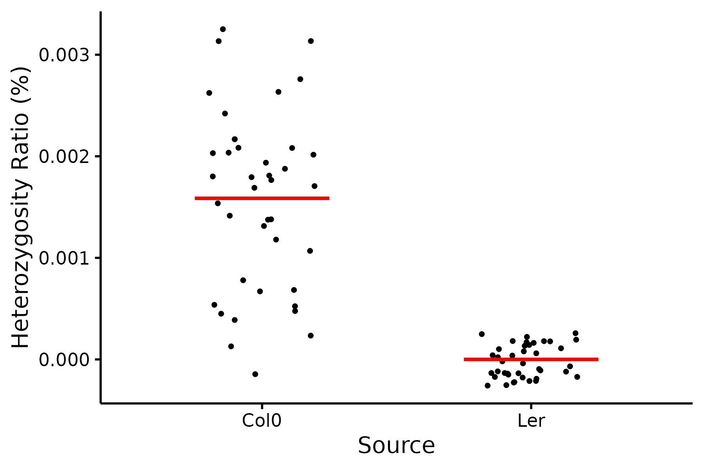

# Progeny Chloroplast Heterozygosity
Use Atha_cross(*Arabidopsis thaliana* Columbia X Ler) as example
## Basic info
* Genome: GCF_000001735.3, TAIR10, 119.668 Mb<br>
* Chloroplast: NC_000932, Columbia, 154478 bp<br>
* Chloroplast: KX551970, Landsberg erecta, 154515 bp<br> Ler-0，另一种常用野生型，与 Col-0 存在遗传差异
* Mitochondrion: Y08501, 366924 bp<br>
## Project
* https://www.pnas.org/content/109/51/20992.long<br>
* PRJNA178613<br>
## Download
* Reference
```
mkdir -p ~/data/plastid/Atha_cross/genome
cd ~/data/plastid/Atha_cross/genome

for ACCESSION in "NC_000932" "Y08501"; do
    URL=$(printf "https://eutils.ncbi.nlm.nih.gov/entrez/eutils/efetch.fcgi?db=nucleotide&rettype=%s&id=%s&retmode=text" "fasta" "${ACCESSION}");
    curl $URL -o ${ACCESSION}.fa
done

TAB=$'\t'
cat <<EOF > replace.tsv
NC_000932${TAB}Pt
Y08501${TAB}Mt
EOF

cat NC_000932.fa Y08501.fa |
    faops filter -s stdin stdout |
    faops replace stdin replace.tsv stdout |
    faops order stdin <(echo Pt; echo Mt) genome.fa
```
* illumina
    * Download Metadata from NCBI SRA Run Selector via a web browser
        * https://trace.ncbi.nlm.nih.gov/Traces/study/?acc=PRJNA178613
```
cat SraRunTable.csv |
    mlr --icsv --otsv cat |
    tsv-select -H -f Experiment,"Sample\ Name",Bases \
    > SraRunTable.tsv

cat SraRunTable.tsv |
    sed '1 s/^/#/' |
    keep-header -- tsv-sort -k2,2 -k3,3nr |
    tsv-uniq -H -f "Sample\ Name" --max 1 |
    mlr --itsv --ocsv cat \
    > source.csv

anchr ena info | perl - -v source.csv > ena_info.yml
anchr ena prep | perl - ena_info.yml --ascp

rgr md ena_info.tsv --fmt

cat ena_info.ascp.sh |
    parallel --no-run-if-empty -j 2 "{}"
```
## Symlink
```
cd ~/data/plastid/Atha_cross/

export FOLD=8
export GENOME_SIZE=$(
    cat ~/data/plastid/genome/col0/chr.sizes |
        tsv-summarize --sum 2
)

cat ena/ena_info.tsv |
    tsv-select -H -f name,srr,bases |
    perl -nla -F'\t' -e '
        BEGIN { our %seen }
        /^name/ and next;
        $seen{$F[0]} and next;
        my $bases = $F[2];
        $bases =~ s/G$//;
        my $cutoff = $bases * 1000 * 1000 * 1000 / $ENV{GENOME_SIZE} * $ENV{FOLD};
        $cutoff = int $cutoff;
        print join qq(\t), ($F[0], $F[1], $cutoff);
        $seen{$F[0]}++;
    ' \
    > opts.tsv

cat opts.tsv |
    parallel --colsep '\t' --no-run-if-empty --linebuffer -k -j 1 '
        if [ ! -f ena/{2}_1.fastq.gz ]; then
            exit;
        fi
        if [ ! -f ena/{2}_2.fastq.gz ]; then
            exit;
        fi

        if [ -f {1}.tar.gz ]; then
            exit;
        fi

        mkdir -p {1}/1_genome
        pushd {1}/1_genome

        cp ../../genome/genome.fa genome.fa
        popd > /dev/null

        mkdir -p {1}/2_illumina
        pushd {1}/2_illumina

        ln -fs ../../ena/{2}_1.fastq.gz R1.fq.gz
        ln -fs ../../ena/{2}_2.fastq.gz R2.fq.gz
        popd > /dev/null
    '
```
## Run anchr
```
cd Atha_cross
cat opts.tsv |
    parallel --colsep '\t' --no-run-if-empty --linebuffer -k -j 1 '
        if [ -f {1}.tar.gz ]; then
            exit;
        fi

        if [ ! -d {1} ]; then
            exit;
        fi

        if [ ! -e {1}/2_illumina/R1.fq.gz ]; then
            exit;
        fi
        if [ ! -e {1}/2_illumina/R2.fq.gz ]; then
            exit;
        fi

        if bjobs -w | tr -s " " | cut -d " " -f 7 | grep -w "^{1}$"; then
            echo Job {1} exists
            exit;
        fi

        cd {1}

        echo {1}

        rm *.sh
        anchr template \
            --genome 1000000 \
            --parallel 24 \
            --xmx 80g \
            \
            --fastqc \
            --insertsize \
            --fastk \
            \
            --trim "--dedupe --cutoff {3} --cutk 31" \
            --qual "25" \
            --len "60" \
            --filter "adapter artifact" \
            \
            --bwa Q25L60 \
            --gatk

        bsub -q mpi -n 24 -J "{1}" "
            bash 0_script/2_fastqc.sh
            bash 0_script/2_insert_size.sh
            bash 0_script/2_fastk.sh
            bash 0_script/2_trim.sh
            bash 0_script/9_stat_reads.sh
            bash 0_script/3_bwa.sh
            bash 0_script/3_gatk.sh
        "
    '
```
## calculate the proportion of sources for variant sites
* find parents' GT difference
```
mkdir -p analysis
cd analysis

#提取亲本
cp ../Sample_Col_G/3_gatk/R.filtered.vcf Col.vcf
cp ../Sample_Ler_XL_4/3_gatk/R.filtered.vcf Ler.vcf

bgzip Col.vcf Ler.vcf

bcftools view --apply-filters PASS --max-alleles 2 --targets Pt  --include "AF>0.01" -Oz Col.vcf.gz > Col_Pt.vcf.gz
bcftools view --apply-filters PASS --max-alleles 2 --targets Pt  --include "AF>0.01" -Oz Ler.vcf.gz > Ler_Pt.vcf.gz
bcftools index Col_Pt.vcf.gz
bcftools index Ler_Pt.vcf.gz

#亲本差异位点
bcftools reheader -s <(echo "Col") Col_Pt.vcf.gz -o Col_Pt.renamed.vcf.gz
bcftools reheader -s <(echo "Ler") Ler_Pt.vcf.gz -o Ler_Pt.renamed.vcf.gz
bcftools index Col_Pt.renamed.vcf.gz
bcftools index Ler_Pt.renamed.vcf.gz

bcftools merge -m all Col_Pt.renamed.vcf.gz Ler_Pt.renamed.vcf.gz -Oz -o Col_Ler.merged.vcf.gz
bcftools index Col_Ler.merged.vcf.gz

bcftools query -f '%CHROM\t%POS\t%REF\t%ALT\t[%GT\t]\n' Col_Ler.merged.vcf.gz > Col_Ler_GT.tsv
awk '$5 != $6' Col_Ler_GT.tsv > different_sites.tsv
```
* extract progeny GT
```
cd ..
mkdir -p vcf
cat opts.tsv |
    parallel --colsep '\t' --no-run-if-empty --linebuffer -k -j 4 '
        if [ ! -d "{1}" ] || [ ! -f "{1}/3_gatk/R.filtered.vcf" ]; then
            echo "样本 {1} 文件缺失，跳过"
            continue
        fi

        echo "处理样本: {1}"
        
        # 处理VCF：重命名样本、筛选Pt、过滤PASS、双等位基因、最小AF
        bcftools reheader --samples <(echo {1}) "{1}/3_gatk/R.filtered.vcf" |
            bcftools view \
                --apply-filters PASS \
                --max-alleles 2 \
                --targets Pt \
                -Oz |
            bcftools view --include "AF>0.01" -Oz -o vcf/{1}.vcf.gz

        # 索引VCF
        bcftools index -f vcf/{1}.vcf.gz
    '

bcftools merge --merge all -l <(
        cat opts.tsv |
            cut -f 1 |
            grep -Ev "^Sample_Col_G$|^Sample_Ler_XL_4$" |
            parallel -k -j 1 ' [ -f vcf/{}.vcf.gz ] && echo "vcf/{}.vcf.gz" '
    ) \
    > Atha_cross.vcf

bcftools stats Atha_cross.vcf > Atha_cross.stats
plot-vcfstats  Atha_cross.stats  -p  plots/Atha_cross.stats

cd analysis
bgzip ../Atha_cross.vcf
bcftools index -f ../Atha_cross.vcf.gz

#与父母本比较
bcftools view -R <(cut -f1,2 different_sites.tsv) ../Atha_cross.vcf.gz -Oz -o F2_informative.vcf.gz

bcftools index F2_informative.vcf.gz
bcftools query -f '%CHROM\t%POS\t[%GT\t]\n' F2_informative.vcf.gz > F2_GT_matrix.tsv
echo -e "CHROM\tPOS\t$(cat ../opts.tsv | cut -f1 | grep -Ev "^Sample_Col_G$|^Sample_Ler_XL_4$" | paste -sd '\t' -)" > header.txt
cat header.txt F2_GT_matrix.tsv > F2_GT_matrix_with_header.tsv
```
* calculate the proportion
```
GENOME_SIZE=154478
total_samples=$(awk -F'\t' '$1 != "Sample_Col_G" && $1 != "Sample_Ler_XL_4"' ../opts.tsv | wc -l)
current=1

# 从父母本差异VCF提取 REF/ALT 变异长度
bcftools query -s Col,Ler -f '%CHROM\t%POS\t%REF\t%ALT\t[%GT\t]\n' Col_Ler.merged.vcf.gz \
| awk -v OFS='\t' '{
    split($4, alts, ",");
    len_ref = length($3);
    len_alt = length(alts[1]);
    if (len_ref == len_alt) {
        len_bp = len_ref;
    } else {
        len_bp = (len_ref > len_alt ? len_ref - len_alt : len_alt - len_ref);
    }
    print $1, $2, $3, alts[1], $5, $6, len_bp;
}' > different_sites_with_len.tsv

bcftools query -f '%CHROM\t%POS\t%REF\t%ALT\n' F2_informative.vcf.gz > F2_sites_ref_alt.tsv

> sample_ratio_tmp.tsv
cat ../opts.tsv | while read -r line; do
    sample=$(echo "$line" | cut -f1)

    if [[ "$sample" == "Sample_Col_G" || "$sample" == "Sample_Ler_XL_4" ]]; then
        continue
    fi

    target_col=$((current + 2))

    echo "[$current/$total_samples] 正在处理样本 $sample，列号 $target_col"

    awk -v OFS='\t' -v target_col="$target_col" -v sample="$sample" -v GENOME_SIZE="$GENOME_SIZE" '
        BEGIN {
            # 父母差异位点长度
            while ((getline < "different_sites_with_len.tsv") > 0) {
                key = $1":"$2
                col_gt[key] = $5
                ler_gt[key] = $6
                site_len[key] = $7
            }
            # F2位点长度
            while ((getline < "F2_sites_ref_alt.tsv") > 0) {
                key = $1":"$2
                len_ref = length($3)
                len_alt = length($4)
                if (len_ref == len_alt) {
                    f2_len[key] = len_ref
                } else {
                    f2_len[key] = (len_ref > len_alt ? len_ref - len_alt : len_alt - len_ref)
                }
            }
            count_col = count_ler = count_mut = total = 0
            len_col = len_ler = len_mut = 0
        }
        NR > 1 {
            key = $1":"$2
            gt = $target_col
            col = col_gt[key]
            ler = ler_gt[key]

            # 优先用父母差异长度
            this_len = (site_len[key] != "" ? site_len[key] : f2_len[key])

            if (gt == "./.") next

            if (gt == col) {
                count_col++
                len_col += this_len
            } else if (gt == ler) {
                count_ler++
                len_ler += this_len
            } else {
                count_mut++
                len_mut += this_len
            }
            total++
        }
        END {
            if (total > 0 && GENOME_SIZE > 0) {
                col_ratio = count_col / total * 100
                ler_ratio = count_ler / total * 100
                mut_ratio = count_mut / total * 100

                col_genome = len_col / GENOME_SIZE * 100
                ler_genome = len_ler / GENOME_SIZE * 100
                mut_genome = len_mut / GENOME_SIZE * 100

                printf("%s\t%.4f\t%.6f\t%.4f\t%.6f\t%.4f\t%.6f\t%d\t%d\t%d\t%d\t%d\t%d\n", \
                    sample, col_ratio, col_genome, ler_ratio, ler_genome, mut_ratio, mut_genome, \
                    count_col, count_ler, count_mut, len_col, len_ler, len_mut)
            } else {
                printf("%s\tNA\tNA\tNA\tNA\tNA\tNA\t0\t0\t0\t0\t0\t0\n", sample)
            }
        }
    ' F2_GT_matrix_with_header.tsv >> sample_ratio_tmp.tsv

    current=$((current + 1))
done

echo -e "Sample\tColRatio\tColGenome\tLerRatio\tLerGenome\tMutRatio\tMutGenome\tColCount\tLerCount\tMutCount\tColLength\tLerLength\tMutLength" > sample_ratio_summary.tsv
cat sample_ratio_tmp.tsv >> sample_ratio_summary.tsv

echo -e "| 样本名称 | Col型比例(%) | Col基因组占比(%) | Ler型比例(%) | Ler基因组占比(%) | 突变型比例(%) | 突变基因组占比(%) | Col型位点数 | Ler型位点数 | 突变型位点数 | Col长度 | Ler长度 | 突变长度 |" > sample_ratio_summary.md
echo -e "| --- | --- | --- | --- | --- | --- | --- | --- | --- | --- | --- | --- | --- |" >> sample_ratio_summary.md

tail -n +2 sample_ratio_summary.tsv | awk -F'\t' '{
    printf("| %s | %s | %s | %s | %s | %s | %s | %d | %d | %d | %d | %d | %d |\n", \
        $1, $2, $3, $4, $5, $6, $7, $8, $9, $10, $11, $12, $13);
}' >> sample_ratio_summary.md

```
| 样本名称 | Col型比例(%) | Col基因组占比(%) | Ler型比例(%) | Ler基因组占比(%) | 突变型比例(%) | 突变基因组占比(%) | Col型位点数 | Ler型位点数 | 突变型位点数 | Col长度 | Ler长度 | 突变长度 |
| --- | --- | --- | --- | --- | --- | --- | --- | --- | --- | --- | --- | --- |
| Sample_14 | 100.0000 | 0.002589 | 0.0000 | 0.000000 | 0.0000 | 0.000000 | 4 | 0 | 0 | 0 | 0 | 0 |
| Sample_18 | 100.0000 | 0.002589 | 0.0000 | 0.000000 | 0.0000 | 0.000000 | 4 | 0 | 0 | 0 | 0 | 0 |
| Sample_19 | 75.0000 | 0.001942 | 0.0000 | 0.000000 | 25.0000 | 0.000647 | 3 | 0 | 1 | 0 | 0 | 0 |
| Sample_20 | 100.0000 | 0.001295 | 0.0000 | 0.000000 | 0.0000 | 0.000000 | 2 | 0 | 0 | 0 | 0 | 0 |
| Sample_21 | 66.6667 | 0.001295 | 0.0000 | 0.000000 | 33.3333 | 0.000647 | 2 | 0 | 1 | 0 | 0 | 0 |
| Sample_4 | 100.0000 | 0.001942 | 0.0000 | 0.000000 | 0.0000 | 0.000000 | 3 | 0 | 0 | 0 | 0 | 0 |
| Sample_5 | 100.0000 | 0.002589 | 0.0000 | 0.000000 | 0.0000 | 0.000000 | 4 | 0 | 0 | 0 | 0 | 0 |
| Sample_6 | 0.0000 | 0.000000 | 100.0000 | 0.000647 | 0.0000 | 0.000000 | 0 | 1 | 0 | 0 | 0 | 0 |
| Sample_7 | 75.0000 | 0.001942 | 0.0000 | 0.000000 | 25.0000 | 0.000647 | 3 | 0 | 1 | 0 | 0 | 0 |
| Sample_8 | 100.0000 | 0.001942 | 0.0000 | 0.000000 | 0.0000 | 0.000000 | 3 | 0 | 0 | 0 | 0 | 0 |
| Sample_c1c2 | 100.0000 | 0.002589 | 0.0000 | 0.000000 | 0.0000 | 0.000000 | 4 | 0 | 0 | 0 | 0 | 0 |
| Sample_c41 | 100.0000 | 0.003237 | 0.0000 | 0.000000 | 0.0000 | 0.000000 | 5 | 0 | 0 | 0 | 0 | 0 |
| Sample_c42 | 66.6667 | 0.001295 | 0.0000 | 0.000000 | 33.3333 | 0.000647 | 2 | 0 | 1 | 0 | 0 | 0 |
| Sample_c45 | 80.0000 | 0.002589 | 0.0000 | 0.000000 | 20.0000 | 0.000647 | 4 | 0 | 1 | 0 | 0 | 0 |
| Sample_c47 | 100.0000 | 0.001295 | 0.0000 | 0.000000 | 0.0000 | 0.000000 | 2 | 0 | 0 | 0 | 0 | 0 |
| Sample_c48 | 80.0000 | 0.002589 | 0.0000 | 0.000000 | 20.0000 | 0.000647 | 4 | 0 | 1 | 0 | 0 | 0 |
| Sample_c51 | 100.0000 | 0.001295 | 0.0000 | 0.000000 | 0.0000 | 0.000000 | 2 | 0 | 0 | 0 | 0 | 0 |
| Sample_c52 | 100.0000 | 0.003884 | 0.0000 | 0.000000 | 0.0000 | 0.000000 | 6 | 0 | 0 | 0 | 0 | 0 |
| Sample_c54 | 100.0000 | 0.002589 | 0.0000 | 0.000000 | 0.0000 | 0.000000 | 4 | 0 | 0 | 0 | 0 | 0 |
| Sample_c57 | 100.0000 | 0.001942 | 0.0000 | 0.000000 | 0.0000 | 0.000000 | 3 | 0 | 0 | 0 | 0 | 0 |
| Sample_c61 | 83.3333 | 0.003237 | 0.0000 | 0.000000 | 16.6667 | 0.000647 | 5 | 0 | 1 | 0 | 0 | 0 |
| Sample_c62 | 50.0000 | 0.000647 | 0.0000 | 0.000000 | 50.0000 | 0.000647 | 1 | 0 | 1 | 0 | 0 | 0 |
| Sample_c63 | 100.0000 | 0.002589 | 0.0000 | 0.000000 | 0.0000 | 0.000000 | 4 | 0 | 0 | 0 | 0 | 0 |
| Sample_c64 | 75.0000 | 0.001942 | 0.0000 | 0.000000 | 25.0000 | 0.000647 | 3 | 0 | 1 | 0 | 0 | 0 |
| Sample_c65 | 33.3333 | 0.000647 | 33.3333 | 0.000647 | 33.3333 | 0.000647 | 1 | 1 | 1 | 0 | 0 | 0 |
| Sample_c66 | 100.0000 | 0.001942 | 0.0000 | 0.000000 | 0.0000 | 0.000000 | 3 | 0 | 0 | 0 | 0 | 0 |
| Sample_c73 | 80.0000 | 0.002589 | 0.0000 | 0.000000 | 20.0000 | 0.000647 | 4 | 0 | 1 | 0 | 0 | 0 |
| Sample_c81 | 100.0000 | 0.001942 | 0.0000 | 0.000000 | 0.0000 | 0.000000 | 3 | 0 | 0 | 0 | 0 | 0 |
| Sample_c82 | 100.0000 | 0.000647 | 0.0000 | 0.000000 | 0.0000 | 0.000000 | 1 | 0 | 0 | 0 | 0 | 0 |
| Sample_c83 | 50.0000 | 0.000647 | 0.0000 | 0.000000 | 50.0000 | 0.000647 | 1 | 0 | 1 | 0 | 0 | 0 |
| Sample_c84 | 100.0000 | 0.001942 | 0.0000 | 0.000000 | 0.0000 | 0.000000 | 3 | 0 | 0 | 0 | 0 | 0 |
| Sample_c85 | 100.0000 | 0.002589 | 0.0000 | 0.000000 | 0.0000 | 0.000000 | 4 | 0 | 0 | 0 | 0 | 0 |
| Sample_c87 | 80.0000 | 0.002589 | 0.0000 | 0.000000 | 20.0000 | 0.000647 | 4 | 0 | 1 | 0 | 0 | 0 |
| Sample_c88 | 100.0000 | 0.002589 | 0.0000 | 0.000000 | 0.0000 | 0.000000 | 4 | 0 | 0 | 0 | 0 | 0 |
| Sample_c89 | 0.0000 | 0.000000 | 0.0000 | 0.000000 | 100.0000 | 0.000647 | 0 | 0 | 1 | 0 | 0 | 0 |
| Sample_c90 | 100.0000 | 0.001295 | 0.0000 | 0.000000 | 0.0000 | 0.000000 | 2 | 0 | 0 | 0 | 0 | 0 |
| Sample_c91 | 100.0000 | 0.000647 | 0.0000 | 0.000000 | 0.0000 | 0.000000 | 1 | 0 | 0 | 0 | 0 | 0 |
| Sample_c92 | 100.0000 | 0.002589 | 0.0000 | 0.000000 | 0.0000 | 0.000000 | 4 | 0 | 0 | 0 | 0 | 0 |
| Sample_c93 | 100.0000 | 0.001295 | 0.0000 | 0.000000 | 0.0000 | 0.000000 | 2 | 0 | 0 | 0 | 0 | 0 |
| Sample_c94 | 100.0000 | 0.002589 | 0.0000 | 0.000000 | 0.0000 | 0.000000 | 4 | 0 | 0 | 0 | 0 | 0 |
| Sample_c95 | 100.0000 | 0.001942 | 0.0000 | 0.000000 | 0.0000 | 0.000000 | 3 | 0 | 0 | 0 | 0 | 0 |
| Sample_l2c2 | 3.9216 | 0.001295 | 88.2353 | 0.029130 | 7.8431 | 0.002589 | 2 | 45 | 4 | 0 | 0 | 0 |
| Sample_l2l3 | 5.7692 | 0.001942 | 80.7692 | 0.027188 | 13.4615 | 0.004531 | 3 | 42 | 7 | 0 | 0 | 0 |
| Sample_l4c1 | 2.0000 | 0.000647 | 90.0000 | 0.029130 | 8.0000 | 0.002589 | 1 | 45 | 4 | 0 | 0 | 0 |
| Sample_l4l3 | 7.4074 | 0.002589 | 83.3333 | 0.029130 | 9.2593 | 0.003237 | 4 | 45 | 5 | 0 | 0 | 0 |

```
library(ggplot2)
library(tidyr)
library(dplyr)

df <- read.table("sample_ratio_summary.tsv", header=TRUE, sep="\t", stringsAsFactors=FALSE)

df_long <- df %>%
  select(Sample, ColGenome, LerGenome) %>%
  pivot_longer(cols = c(ColGenome, LerGenome), names_to = "来源", values_to = "占比") %>%
  filter(!is.na(占比))

df_long$来源 <- recode(df_long$来源,
                        ColGenome = "Col0",
                        LerGenome = "Ler")

p <- ggplot(df_long, aes(x=来源, y=占比)) +
  geom_jitter(width=0.2, size=1, color="black") +
  stat_summary(fun=mean, geom="crossbar", width=0.5, fatten=2, color="red") +
  labs(x="Source", y="Heterozygosity Ratio (%)") +
  theme_minimal(base_size = 14) +
  theme(
    panel.grid = element_blank(),
    axis.line = element_line(color="black"),
    axis.ticks = element_line(color="black"),
    axis.text = element_text(color="black"),
    axis.title = element_text(color="black"),
    plot.background = element_rect(fill="white", color=NA),
    panel.background = element_rect(fill="white", color=NA)
  )

ggsave("genome_proportion_dotplot.png", p, width=6, height=4, dpi=300)
```
