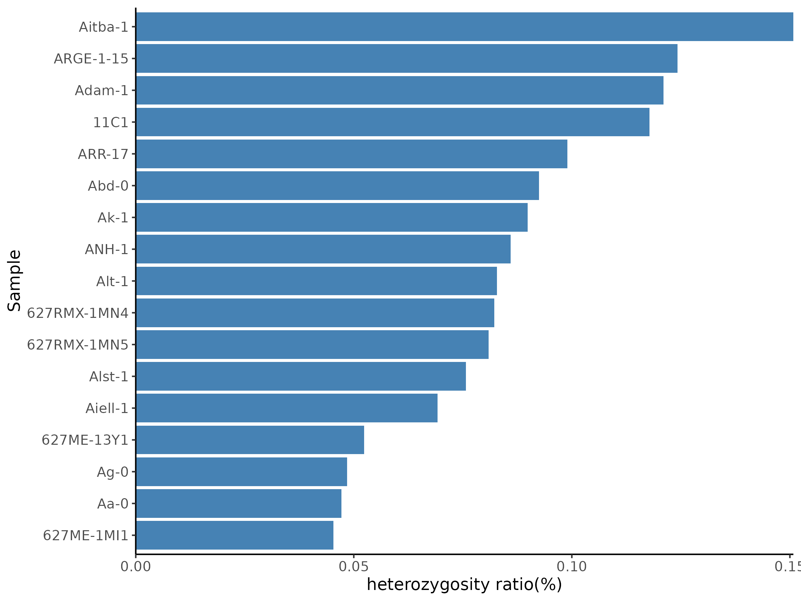

# *Arabidopsis thaliana* 1001 Genomes Project
## Basic info
* Genome: GCF_000001735.3, TAIR10, 119.668 Mb<br>
* Chloroplast: NC_000932, Columbia, 154478 bp<br>
* Chloroplast: KX551970, Landsberg erecta, 154515 bp<br> Ler-0，另一种常用野生型，与 Col-0 存在遗传差异
* Mitochondrion: Y08501, 366924 bp<br>
# Project
* PRJNA273563
# Download
* reference
```
mkdir -p Atha_1001/genome
cd Atha_1001/genome
cp ../../Atha_cross/genome/genome.fa .
```
* illumina
    * Download Metadata from NCBI SRA Run Selector via a web browser
        * https://trace.ncbi.nlm.nih.gov/Traces/study/?acc=PRJNA273563
    * Download Accessions info
        * http://1001genomes.org/accessions.html
```
mkdir -p Atha_1001/ena
cd Atha_1001/ena

cat SraRunTable.csv |
    mlr --icsv --otsv cat \
    > SraRunTable.tsv

cat SraRunTable.tsv |
    tsv-filter -H \
        --str-in-fld tissue:leaf \
        --ge AvgSpotLen:90

curl -o accessions.csv \
    https://tools.1001genomes.org/api/accessions.csv?query=SELECT%20*%20FROM%20tg_accessions%20ORDER%20BY%20id

echo -e 'Ecotype\tName\tCS Number\tCountry\tLat\tLong\tCollector\tAdmixture Group\tSequenced by' \
    > accessions.tsv

cat accessions.csv |
    mlr --icsv --implicit-csv-header --otsv cat |
    sed 1d |
    tsv-select -f 1,3,10,4,6,7,8,11,2 \
    >> accessions.tsv

cat accessions.tsv |
    tsv-join -H --key-fields "Ecotype" \
        -f SraRunTable.tsv \
        --append-fields tissue,AvgSpotLen,Bases,Experiment |
    tsv-filter -H \
        --str-in-fld tissue:leaf \
        --ge Bases:1000000000 \
        --le Bases:10000000000 \
        --ge AvgSpotLen:90 \
        --regex Name:'^[\w\d-]+$' |
    tsv-select -H -f Experiment,Name,Country |
    mlr --itsv --ocsv cat |
    sed 1d \
    > source.csv


anchr ena info | perl - -v source.csv > ena_info.yml
anchr ena prep | perl - ena_info.yml --ascp

rgr md ena_info.tsv --fmt | head -n 20

# sort by SRR
cat ena_info.ascp.sh |
    sort > tmp.sh &&
    mv tmp.sh ena_info.ascp.sh

cat ena_info.ascp.sh |
    parallel --no-run-if-empty -j 2 "{}"

md5sum --check ena_info.md5.txt

cat ena_info.tsv |
    tsv-select -H -f name,srr,bases |
    parallel --colsep '\t' --no-run-if-empty --linebuffer -k -j 4 '
        if [ ! -f {2}_1.fastq.gz ]; then
            echo 1>&2 {1}
            echo {1}
            exit;
        fi
        if [ ! -f {2}_2.fastq.gz ]; then
            echo 1>&2 {1}
            echo {1}
            exit;
        fi

        LENGTH=$(gzip -dcf {2}_1.fastq.gz |
            head -n 100 |
            faops n50 -H stdin
        )
        [[ $LENGTH -le 90 ]] && ( echo 1>&2 {1}; echo {1}; exit; )

        LENGTH=$(gzip -dcf {2}_2.fastq.gz |
            head -n 100 |
            faops n50 -H stdin
        )
        [[ $LENGTH -le 90 ]] && ( echo 1>&2 {1}; echo {1}; exit;  )
    ' |
    sort -r |
    uniq \
    > skip.lst

(
    echo -e "name"
    grep -v '^name$' skip.lst | sort -u
) > skip.tsv

rsync -avP \
    ~/project/plastid/Atha_1001/ \
    wangq@202.119.37.251:zxy/plastid/Atha_1001/ena
```
| name        | srx       | platform | layout | ilength | srr        |      spots | bases |
|-------------|-----------|----------|--------|---------|------------|-----------:|-------|
| 11C1        | SRX972788 | ILLUMINA | PAIRED |         | SRR1946105 | 20,357,230 | 3.79G |
| 328PNA062   | SRX972701 | ILLUMINA | PAIRED |         | SRR1946018 | 73,235,208 | 6.62G |
| 627ME-13Y1  | SRX972634 | ILLUMINA | PAIRED |         | SRR1945951 | 44,902,951 | 8.28G |
| 627ME-1MI1  | SRX972635 | ILLUMINA | PAIRED |         | SRR1945952 | 48,675,298 | 8.98G |
| 627RMX-1MN4 | SRX972632 | ILLUMINA | PAIRED |         | SRR1945949 | 37,102,228 | 6.82G |
| 627RMX-1MN5 | SRX972633 | ILLUMINA | PAIRED |         | SRR1945950 | 44,085,175 | 8.11G |
| ANH-1       | SRX972422 | ILLUMINA | PAIRED |         | SRR1945739 | 10,783,643 | 2.03G |
| ARGE-1-15   | SRX973146 | ILLUMINA | PAIRED |         | SRR1946463 | 25,951,374 | 4.83G |
| ARR-17      | SRX973157 | ILLUMINA | PAIRED |         | SRR1946474 | 14,893,935 | 2.77G |
| Aa-0        | SRX972490 | ILLUMINA | PAIRED |         | SRR1945807 |  9,051,264 | 1.7G  |
| Abd-0       | SRX972484 | ILLUMINA | PAIRED |         | SRR1945801 | 13,961,306 | 2.63G |
| Adam-1      | SRX972881 | ILLUMINA | PAIRED |         | SRR1946198 | 12,010,826 | 2.24G |
| Ag-0        | SRX972432 | ILLUMINA | PAIRED |         | SRR1945749 | 10,141,217 | 1.91G |
| Aiell-1     | SRX972915 | ILLUMINA | PAIRED |         | SRR1946232 | 12,869,053 | 2.4G  |
| Aitba-1     | SRX972878 | ILLUMINA | PAIRED |         | SRR1946195 | 11,730,031 | 2.18G |
| Ak-1        | SRX972485 | ILLUMINA | PAIRED |         | SRR1945802 |  8,524,299 | 1.6G  |
| Alst-1      | SRX972486 | ILLUMINA | PAIRED |         | SRR1945803 |  9,347,634 | 1.76G |
| Alt-1       | SRX973020 | ILLUMINA | PAIRED |         | SRR1946337 | 24,312,469 | 4.53G |
# Symlink
```
export FOLD=2
export GENOME_SIZE=$(
    cat ~/data/plastid/genome/col0/chr.sizes |
        tsv-summarize --sum 2
)

cat ena/ena_info.tsv |
    tsv-select -H -f name,srr,bases |
    tsv-join -H --filter-file ena/skip.tsv --key-fields name --exclude |
    perl -nla -F'\t' -e '
        BEGIN { our %seen }
        /^name/ and next;
        $seen{$F[0]} and next;
        my $bases = $F[2];
        $bases =~ s/G$//;
        my $cutoff = $bases * 1000 * 1000 * 1000 / $ENV{GENOME_SIZE} * $ENV{FOLD};
        $cutoff = int $cutoff;
        print join qq(\t), ($F[0], $F[1], $cutoff);
        $seen{$F[0]}++;
    ' \
    > opts.tsv

cat opts.tsv |
    parallel --colsep '\t' --no-run-if-empty --linebuffer -k -j 1 '
        if [ ! -f ena/{2}_1.fastq.gz ]; then
            exit;
        fi
        if [ ! -f ena/{2}_2.fastq.gz ]; then
            exit;
        fi

        if [ -f {1}.tar.gz ]; then
            exit;
        fi

        mkdir -p {1}/1_genome
        pushd {1}/1_genome

        cp ../../genome/genome.fa genome.fa
        popd > /dev/null

        mkdir -p {1}/2_illumina
        pushd {1}/2_illumina

        ln -fs ../../ena/{2}_1.fastq.gz R1.fq.gz
        ln -fs ../../ena/{2}_2.fastq.gz R2.fq.gz
        popd > /dev/null
    '
```
# Run
```
cat opts.tsv |
    parallel --colsep '\t' --no-run-if-empty --linebuffer -k -j 1 '
        if [ -f {1}.tar.gz ]; then
            exit;
        fi

        if [ ! -d {1} ]; then
            exit;
        fi

        if [ ! -e {1}/2_illumina/R1.fq.gz ]; then
            exit;
        fi
        if [ ! -e {1}/2_illumina/R2.fq.gz ]; then
            exit;
        fi

        if bjobs -w | tr -s " " | cut -d " " -f 7 | grep -w "^{1}$"; then
            echo Job {1} exists
            exit;
        fi

        cd {1}

        echo {1}

        rm *.sh
        anchr template \
            --genome 1000000 \
            --parallel 24 \
            --xmx 80g \
            \
            --fastqc \
            --insertsize \
            --fastk \
            \
            --trim "--dedupe --cutoff {3} --cutk 31" \
            --qual "25" \
            --len "60" \
            --filter "adapter artifact" \
            \
            --bwa Q25L60 \
            --gatk

        bsub -q mpi -n 24 -J "{1}" "
            bash 0_script/2_fastqc.sh
            bash 0_script/2_insert_size.sh
            bash 0_script/2_fastk.sh
            bash 0_script/2_trim.sh
            bash 0_script/9_stat_reads.sh
            bash 0_script/3_bwa.sh
            bash 0_script/3_gatk.sh
        "
    '
```
# heterogeneity
```
mkdir -p vcf
cat opts.tsv |
    parallel --colsep '\t' --no-run-if-empty --linebuffer -k -j 4 '
        if [ ! -d "{1}" ] || [ ! -f "{1}/3_gatk/R.filtered.vcf" ]; then
            echo "样本 {1} 文件缺失，跳过"
            continue
        fi

        echo "处理样本: {1}"
        
        # 处理VCF：重命名样本、筛选Pt、过滤PASS、双等位基因、最小AF
        bcftools reheader --samples <(echo {1}) "{1}/3_gatk/R.filtered.vcf" |
            bcftools view \
                --apply-filters PASS \
                --max-alleles 2 \
                --types snps \
                --targets Pt \
                -Oz |
            bcftools view --include "AF>0.01" -Oz -o vcf/{1}.vcf.gz

        # 索引VCF
        bcftools index -f vcf/{1}.vcf.gz
    '
bcftools merge --merge all -l <(
        cat opts.tsv |
            cut -f 1 |
            parallel -k -j 1 ' [ -f vcf/{}.vcf.gz ] && echo "vcf/{}.vcf.gz" '
    ) \
    > Atha_1001.vcf

bcftools stats Atha_1001.vcf > Atha_1001.stats

cat opts.tsv | cut -f 1 > sample_list.txt
GENOME_SIZE=154478

echo -e "样本名称\t异质位点数\t比例(%)" > sample_heterozygosity_summary.tsv

while read sample; do
    echo "[INFO] 处理样本: $sample"

    bcftools view -s $sample Atha_1001.vcf -Ov -o tmp_${sample}.vcf

    variant_count=$(bcftools query -f '[%GT\n]' tmp_${sample}.vcf | grep -v -E '0/0|\.\/\.' | wc -l)

    ratio=$(echo "scale=6; $variant_count / $GENOME_SIZE * 100" | bc)
    ratio=$(printf "%0.6f" $ratio)

    echo -e "$sample\t$variant_count\t$ratio" >> sample_heterozygosity_summary.tsv

    rm tmp_${sample}.vcf
done < sample_list.txt

echo -e "| 样本名称 | 异质位点数 | 比例(%) |" > sample_heterozygosity_summary.md
echo -e "| --- | --- | --- |" >> sample_heterozygosity_summary.md

tail -n +2 sample_heterozygosity_summary.tsv | awk -F'\t' '{printf("| %s | %s | %s |\n", $1, $2, $3)}' >> sample_heterozygosity_summary.md
tail -n +2 sample_heterozygosity_summary.tsv \
| perl -F'\t' -ane 'printf("| %s | %s | %s |\n", $F[0], $F[1], $F[2])' \
>> sample_heterozygosity_summary_perl.md
```
| 样本名称 | 异质位点数 | 比例(%) |
| --- | --- | --- |
| 11C1 | 182 | 0.117800 |
| 627ME-13Y1 | 81 | 0.052400 |
| 627ME-1MI1 | 70 | 0.045300 |
| 627RMX-1MN4 | 127 | 0.082200 |
| 627RMX-1MN5 | 125 | 0.080900 |
| ANH-1 | 133 | 0.086000 |
| ARGE-1-15 | 192 | 0.124200 |
| ARR-17 | 153 | 0.099000 |
| Aa-0 | 73 | 0.047200 |
| Abd-0 | 143 | 0.092500 |
| Adam-1 | 187 | 0.121000 |
| Ag-0 | 75 | 0.048500 |
| Aiell-1 | 107 | 0.069200 |
| Aitba-1 | 233 | 0.150800 |
| Ak-1 | 139 | 0.089900 |
| Alst-1 | 117 | 0.075700 |
| Alt-1 | 128 | 0.082800 |
```
library(ggplot2)
library(readr)
library(dplyr)


df <- read_tsv("sample_heterozygosity_summary.tsv")
df <- df %>% arrange(`比例(%)`)
df$样本名称 <- factor(df$样本名称, levels = df$样本名称)

p <- ggplot(df, aes(x = `比例(%)`, y = 样本名称)) +
  geom_bar(stat = "identity", fill = "steelblue") +
  labs(x = "heterozygosity ratio(%)", y = "Sample") +
  scale_x_continuous(expand = c(0, 0), limits = c(0, NA)) +
  theme(
    panel.background = element_rect(fill = "white"),
    panel.grid = element_blank(),
    axis.line = element_line(color = "black"),
    axis.title = element_text(size = 12),
    axis.text = element_text(size = 10),
    plot.title = element_blank()
  )

ggsave("heterozygosity_barplot.png", plot = p, width = 8, height = 6, dpi = 300)
```

# MAF
```
bcftools query \
  -f '%CHROM\t%POS\t%REF\t%ALT[\t%SAMPLE\t%AF]\n' \
  Atha_1001.vcf |
awk '
BEGIN{
    OFS="\t";
    print "CHROM","POS","REF","ALT","SAMPLE","AF","MAF"
}
{
    chrom=$1; pos=$2; ref=$3;
    n_alt = split($4, ALT, ",")

    for (i=5; i<=NF; i+=2) {
        sample = $i
        af_str = $(i+1)
        if (af_str=="." || af_str=="") continue

        n_af = split(af_str, AF, ",")

        min_maf = 1
        best_j = -1

        for (j=1; j<=n_af && j<=n_alt; j++) {
            if (AF[j]=="." || AF[j]=="") continue
            af  = AF[j] + 0
            maf = (af < 0.5 ? af : 1 - af)
            if (maf < min_maf) {
                min_maf = maf
                best_j = j
            }
        }

        if (best_j > 0)
            print chrom,pos,ref,ALT[best_j],sample,AF[best_j],min_maf
    }
}
' |
sort -k5,5 -k1,1 -k2,2n \
> site_sample_MAF.all.tsv
#过滤DP<10
bcftools query \
  -f '%CHROM\t%POS\t%REF\t%ALT[\t%SAMPLE\t%AF\t%DP]\n' \
  Atha_1001.vcf \
| awk '
BEGIN{
    OFS="\t";
    print "CHROM","POS","REF","ALT","SAMPLE","AF","MAF","DP"
}
{
    chrom=$1; pos=$2; ref=$3;
    n_alt = split($4, ALT, ",")

    for (i=5; i<=NF; i+=3) {        # 每 3 列： SAMPLE AF DP
        sample = $i
        af_str = $(i+1)
        dp     = $(i+2) + 0

        if (af_str=="." || af_str=="" || dp<10) continue   # DP<10 跳过

        n_af = split(af_str, AF, ",")

        min_maf = 1
        best_j = -1

        for (j=1; j<=n_af && j<=n_alt; j++) {
            if (AF[j]=="." || AF[j]=="") continue
            af  = AF[j] + 0
            maf = (af < 0.5 ? af : 1 - af)
            if (maf < min_maf) {
                min_maf = maf
                best_j = j
            }
        }

        if (best_j > 0)
            print chrom,pos,ref,ALT[best_j],sample,AF[best_j],min_maf,dp
    }
}
' \
| sort -k5,5 -k1,1 -k2,2n \
> site_sample_MAF.all.DP10.tsv

#过滤<0.02
awk '
BEGIN{OFS="\t"}
NR==1{print; next}
$7 >= 0.02
' site_sample_MAF.all.DP10.tsv \
> site_sample_MAF.filtered.temp.tsv

awk -F'\t' '
$1=="CHROM" && $2=="POS" && $3=="REF" && $4=="ALT" && $5=="SAMPLE" {
    if (!seen_header) {
        header = $0
        seen_header = 1
    }
    next
}
{
    body[++n] = $0
}
END {
    print header
    for (i=1; i<=n; i++) print body[i]
}
' site_sample_MAF.filtered.temp.tsv > site_sample_MAF.filtered.tsv


# 筛选出异质性位点数 >= 10 的样本
tail -n +2 site_sample_MAF.filtered.tsv | \
awk -F'\t' '{ count[$5]++ } END { for (s in count) print s, count[s] }' \
> sample_het_counts.tsv

awk '$2 >= 10 { print $1 }' sample_het_counts.tsv \
> samples_het10.txt


awk -F'\t' '
NR==FNR { keep[$1]; next }   # 读取 samples_het10.txt
NR==1 { print; next }        # 打印 header
{ if ($5 in keep) print }    # 只保留数组中的样本
' samples_het10.txt site_sample_MAF.filtered.tsv > site_sample_MAF.filtered_het10.tsv

#平均MAF
awk -F'\t' '
{
    sum[$5] += $7   # 第5列 SAMPLE，第7列 MAF
    n[$5]++
}
END{
    print "SAMPLE","MEAN_MAF","N_SITES"
    for (s in sum)
        print s, sum[s]/n[s], n[s]
}
' site_sample_MAF.filtered_het10.tsv \
| sort -k2,2nr \
> sample_mean_MAF.tsv

cd ../wild_new
R
#dot plot
library(tidyverse)

# 读取数据
df <- read.delim(
  "site_sample_MAF.filtered_het10.tsv",
  stringsAsFactors = FALSE,
  header = FALSE
)
colnames(df) <- c("CHROM","POS","REF","ALT","SAMPLE","AF","MAF")

# 确保样本顺序是按名称排序（和你文件一致）
df$SAMPLE <- factor(
  df$SAMPLE,
  levels = sort(unique(df$SAMPLE))
)

# 绘图
p <- ggplot(df, aes(x = SAMPLE, y = MAF)) +
  geom_jitter(
    width = 0.25,        # 横向抖动，避免点重叠
    size = 1,
    alpha = 0.7,
    color = "#1F4E79"    # 修改点颜色
  ) +
  scale_y_continuous(
    limits = c(0, 0.2),
    breaks = seq(0, 0.25, by = 0.05), 
    expand = expansion(mult = c(0, 0.05))
  ) +
  labs(
    x = "Sample",
    y = "Minor Allele Frequency (MAF)"
  ) +
  theme_classic() +
  theme(
    axis.text.x = element_text(
      angle = 45,
      hjust = 1,
      vjust = 1
    ),
    axis.title = element_text(size = 12),
    axis.text = element_text(size = 10)
  )

# 保存图片
ggsave(
  "MAF_dotplot_per_sample_filtered.pdf",
  p,
  width = 6,
  height = 4
)

ggsave(
  "MAF_dotplot_per_sample_filtered.png",
  p,
  width = 6,
  height = 4,
  dpi = 300
)

#柱状图

library(ggplot2)
library(dplyr)

df <- read.delim(
  "site_sample_MAF.filtered_het10.tsv",
  stringsAsFactors = FALSE,
  header = FALSE
)
colnames(df) <- c("CHROM","POS","REF","ALT","SAMPLE","AF","MAF","DP")
df_count <- df %>%
  count(SAMPLE, name = "Het_sites")


#df_count <- df_count %>%
#  arrange(desc(Het_sites)) %>%
#  mutate(
#    SAMPLE = factor(SAMPLE, levels = SAMPLE)
#  )


p <- ggplot(df_count, aes(x = SAMPLE, y = Het_sites)) +
  geom_col(fill = "#1F4E79", width = 0.8) +
  geom_text(
    aes(label = Het_sites),
    vjust = -0.3,     # 文字在柱子上方
    size = 3
  ) +
  labs(
    x = "Sample",
    y = "Number of heteroplasmic sites"
  ) +
  theme_classic() +
  theme(
    axis.text.x = element_text(
      angle = 45,
      hjust = 1,
      vjust = 1,
      size = 10
    ),
    axis.title = element_text(size = 12),
    plot.title = element_text(hjust = 0.5)
  )


ggsave(
  "Het_site_count_barplot.pdf",
  p,
  width = 6,
  height = 4
)

ggsave(
  "Het_site_count_barplot.png",
  p,
  width = 6,
  height = 4,
  dpi = 300
)

```
# AF
```
#堆叠图 
library(ggplot2)
library(dplyr)

df <- read.delim(
  "site_sample_MAF.filtered_het10.tsv",
  stringsAsFactors = FALSE,
  header = FALSE
)
colnames(df) <- c("CHROM","POS","REF","ALT","SAMPLE","AF","MAF","DP")

df_one <- df %>%
  filter(SAMPLE == "Aitba-1") %>%
  mutate(
    AF = as.numeric(AF)
  ) %>%
  arrange(CHROM, POS) %>%
  mutate(site_id = row_number())

df_one <- df_one %>%
  arrange(CHROM, POS) %>%
  mutate(
    site_label = as.character(POS),
    site_id = factor(site_label, levels = rev(site_label))
  )


df_long <- df_one %>%
  transmute(
    site_id,
    AF = AF,
    Complement = 1 - AF
  ) %>%
  pivot_longer(
    cols = c(AF, Complement),
    names_to = "Type",
    values_to = "Frequency"
  )


df_long$Type <- factor(
  df_long$Type,
  levels = c("Complement", "AF")
)

p <- ggplot(
  df_long,
  aes(x = site_id, y = Frequency, fill = Type)
) +
  geom_col(width = 0.8) +
  coord_flip() +
  scale_y_continuous(
    limits = c(0, 1),
    expand = c(0, 0)
  ) +
  scale_fill_manual(
    values = c(
      AF = "firebrick",
      Complement = "grey80"
    )
  ) +
  labs(
    x = "Variant site",
    y = "Heteroplasmic frequency",
    title = "Aitba-1"
  ) +
  theme_classic() +
  theme(
    legend.position = "none",
    axis.text.y = element_text(size = 5),  
    axis.ticks.y = element_line(),
    axis.text.x = element_text(size = 10),
    axis.title = element_text(size = 12),
    plot.title = element_text(hjust = 0.5)
  )


ggsave(
  "Aitba-1_AF_stacked_to1.pdf",
  p,
  width = 7,
  height = 7
)

ggsave(
  "Aitba-1_AF_stacked_to1.png",
  p,
  width = 7,
  height = 7,
  dpi = 300
)


#Draha2
df_one <- df %>%
  filter(SAMPLE == "Draha2") %>%
  mutate(
    AF = as.numeric(AF)
  ) %>%
  arrange(CHROM, POS) %>%
  mutate(site_id = row_number())

df_one <- df_one %>%
  arrange(CHROM, POS) %>%
  mutate(
    site_label = as.character(POS),
    site_id = factor(site_label, levels = rev(site_label))
  )


df_long <- df_one %>%
  transmute(
    site_id,
    AF = AF,
    Complement = 1 - AF
  ) %>%
  pivot_longer(
    cols = c(AF, Complement),
    names_to = "Type",
    values_to = "Frequency"
  )


df_long$Type <- factor(
  df_long$Type,
  levels = c("Complement", "AF")
)

p <- ggplot(
  df_long,
  aes(x = site_id, y = Frequency, fill = Type)
) +
  geom_col(width = 0.8) +
  coord_flip() +
  scale_y_continuous(
    limits = c(0, 1),
    expand = c(0, 0)
  ) +
  scale_fill_manual(
    values = c(
      AF = "firebrick",
      Complement = "grey80"
    )
  ) +
  labs(
    x = "Variant site",
    y = "Heteroplasmic frequency",
    title = "Draha2"
  ) +
  theme_classic() +
  theme(
    legend.position = "none",
    axis.text.y = element_text(size = 10),  
    axis.ticks.y = element_line(),
    axis.text.x = element_text(size = 10),
    axis.title = element_text(size = 12),
    plot.title = element_text(hjust = 0.5)
  )


ggsave(
  "Draha2_AF_stacked_to1.pdf",
  p,
  width = 7,
  height = 7
)

ggsave(
  "Draha2_AF_stacked_to1.png",
  p,
  width = 7,
  height = 7,
  dpi = 300
)
```
# filter
```
#过滤MAF<0.01
bgzip Atha_1001.vcf
bcftools index -f Atha_1001.vcf.gz
bcftools norm -m -any -f genome/Pt.fa Atha_1001.vcf.gz -Oz -o Atha_1001.split.vcf.gz
bcftools index Atha_1001.split.vcf.gz

bcftools query \
  -f '%CHROM\t%POS[\t%AF]\n' \
  Atha_1001.split.vcf.gz |
awk '
{
    n_sample = NF - 2
    count = 0
    for (i=3; i<=NF; i++) {
        if ($i == "." || $i == "") continue

        split($i, afs, ",")
        min_maf = 1

        for (j in afs) {
            if (afs[j] == "." || afs[j] == "") continue
            af = afs[j] + 0
            maf = (af < 0.5 ? af : 1 - af)
            if (maf < min_maf)
                min_maf = maf
        }

        if (min_maf >= 0.01)
            count++
    }

    if (count > 0)
        print $1 "\t" $2 "\t" count "\t" n_sample
}
' > site_MAF01_count.tsv

#过滤小于10%出现的位点
awk '
{
    if ($3 >= 0.1 * $4)
        print $1 "\t" $2
}
' site_MAF01_count.tsv > sites_MAF01_ge_10percent.tsv

bcftools view \
  -R sites_MAF01_ge_10percent.tsv \
  Atha_1001.split.vcf.gz \
  -Oz -o Atha_1001.MAF01.vcf.gz

bcftools index Atha_1001.MAF01.vcf.gz

#去除与核基因组/线粒体基因组相似序列
cd genome
samtools faidx genome.fa Pt > Pt.fa
samtools faidx genome.fa Mt > Mt.fa
samtools faidx genome.fa 1 2 3 4 5 > nuclear.fa
cat Mt.fa nuclear.fa > non_pt.fa
minimap2 -x asm5 Pt.fa non_pt.fa > Pt_vs_nonPt.paf
awk '
{
    qlen = $11
    alen = $10
    if (alen/qlen >= 0.9 && alen >= 100) {
        print $6 "\t" $8 "\t" $9
    }
}
' Pt_vs_nonPt.paf |
sort -k1,1 -k2,2n |
bedtools merge > Pt_similar_to_nonPt.bed
cp Pt_similar_to_nonPt.bed ../
cd ..

bcftools view \
  -T ^Pt_similar_to_nonPt.bed \
  Atha_1001.MAF01.vcf.gz \
  -Oz -o Atha_1001.no_similar.vcf.gz

bcftools index Atha_1001.no_similar.vcf.gz


#去除50bp连续出现的位点
bcftools query \
  -f '%CHROM\t%POS\n' \
  Atha_1001.no_similar.vcf.gz |
sort -k1,1 -k2,2n |
awk '
{
    if ($1==chr && $2-prev < 50) next
    print
    chr=$1; prev=$2
}
' > sites_non_clustered.tsv

bcftools view \
  -R sites_non_clustered.tsv \
  Atha_1001.no_similar.vcf.gz \
  -Oz -o Atha_1001.no_cluster.vcf.gz

bcftools index Atha_1001.no_cluster.vcf.gz


#去除pcr错误（单碱基重复）
cp genome/Pt.fa .
samtools faidx genome/Pt.fa Pt |
sed '1d' |
tr -d '\n' |
awk '
{
    seq=$0
    for (i=1;i<=length(seq)-4;i++) {
        k=substr(seq,i,5)
        if (k~/^(A{5}|T{5}|C{5}|G{5})$/)
            print "Pt\t" i-2 "\t" i+6
    }
}
' |
awk '$2<1{$2=1}{print}' |
sort -k2,2n |
bedtools merge > Pt_homopolymer_pm2bp.bed

bcftools view \
  -T ^Pt_homopolymer_pm2bp.bed \
  Atha_1001.no_cluster.vcf.gz \
  -Oz -o Atha_1001.strict_filtered.vcf.gz

bcftools index Atha_1001.strict_filtered.vcf.gz


```
# 计算过滤后的MAF
# MAF
```

bcftools query \
  -f '%CHROM\t%POS\t%REF\t%ALT[\t%SAMPLE\t%AF]\n' \
  Atha_1001.strict_filtered.vcf.gz |
awk '
BEGIN{ OFS="\t" }
{
    for (i=5;i<=NF;i+=2) {
        s=$i; af=$(i+1)
        if (af=="." || af=="") continue
        maf=(af<0.5?af:1-af)
        if (maf >= 0.01)
            print $1,$2,$3,$4,s,af,maf
    }
}
' |
sort -k5,5 -k1,1 -k2,2n \
> site_sample_MAF.filtered.body.tsv

{
  echo -e "CHROM\tPOS\tREF\tALT\tSAMPLE\tAF\tMAF"
  cat site_sample_MAF.filtered.body.tsv
} > site_sample_MAF.filtered.tsv

tail -n +2 site_sample_MAF.filtered.tsv | \
awk -F'\t' '{ count[$5]++ } END { for (s in count) print s, count[s] }' \
> sample_het_counts.tsv

# 筛选出异质性位点数 >= 4 的样本
awk '$2 >= 4 { print $1 }' sample_het_counts.tsv \
> samples_het4.txt


awk -F'\t' '
NR==FNR { keep[$1]; next }   # 读取 samples_het10.txt
NR==1 { print; next }        # 打印 header
{ if ($5 in keep) print }    # 只保留数组中的样本
' samples_het4.txt site_sample_MAF.filtered.tsv > site_sample_MAF.filtered_het4.tsv


# 筛选出异质性位点数 >= 4 的样本
tail -n +2 site_sample_MAF.filtered.tsv |
awk -F'\t' '
{
    count[$5]++
}
END{
    print "SAMPLE\tN_variant"
    for (s in count)
        print s "\t" count[s]
}
' > sample_variant_counts.tsv

awk '
NR==1 {print; next}
$2 >= 4
' sample_variant_counts.tsv > sample_variant_counts.ge5.tsv
awk 'NR>1 {print $1}' sample_variant_counts.ge5.tsv > samples_true_variant.txt

total=$(awk 'NR>1{print $1}' sample_variant_counts.tsv | wc -l)
true=$(wc -l < samples_true_variant.txt)

total=$(tail -n +1 opts.tsv | wc -l)  # 50
true=$(wc -l < samples_true_variant.txt)  # 7
false=$((total - true))  # 43

echo -e "Category\tCount" > heteroplasmy_ratio.tsv
echo -e "True_heteroplasmy\t$true" >> heteroplasmy_ratio.tsv
echo -e "No_or_low_heteroplasmy\t$false" >> heteroplasmy_ratio.tsv

#pie plot
library(ggplot2)

df <- read.table("heteroplasmy_ratio.tsv", header=TRUE, sep="\t")

p <- ggplot(df, aes(x="", y=Count, fill=Category)) +
  geom_bar(stat="identity", width=1, color="black") +   # 黑色边框
  coord_polar("y") +
  theme_void() +                                        # 干净背景
  scale_fill_manual(values=c("black", "white")) +      # 黑白配色
  geom_text(aes(label=paste0(Count, " (", 
                             round(Count/sum(Count)*100,1), "%)")),
            position=position_stack(vjust=0.5),
            color="red") +                           # 标签黑色
  ggtitle("Proportion of true heteroplasmic samples") +
  theme(plot.background = element_rect(fill="white", color=NA))  # 白色图背景

# 保存图片
ggsave(
  "Proportion_of_true_heteroplasmic_samples.png",
  p,
  width = 6,    # 适当比例
  height = 6,
  dpi = 300
)

#柱状图
library(ggplot2)
library(dplyr)

# 读取样本变异位点数数据
df <- read.table("sample_variant_counts.ge5.tsv", header=TRUE, sep="\t")

# 可以按变异位点数排序，便于展示
df <- df %>% arrange(desc(N_variant))

# 绘制柱状图
p <- ggplot(df, aes(x=reorder(SAMPLE, -N_variant), y=N_variant)) +
  geom_bar(stat="identity", fill="grey70", color="black") +  # 黑白配色
  theme_minimal(base_size = 14) +                             # 干净背景
  theme(
    axis.text.x = element_text(angle = 45, hjust = 1),       # x轴标签倾斜
    panel.grid.major.x = element_blank(),                    # 去掉竖直网格
    panel.grid.minor = element_blank(),
    plot.background = element_rect(fill="white", color=NA)   # 白色背景
  ) +
  labs(
    x = "Sample",
    y = "Number of heteroplasmic sites",
    title = "Heteroplasmic site counts per sample"
  )

# 保存图片
ggsave(
  "Heteroplasmic_site_counts_per_sample.png",
  p,
  width = 12,
  height = 6,
  dpi = 300
)


#dot plot
library(tidyverse)

# 读取数据
df <- read.delim(
  "site_sample_MAF.filtered_het4.tsv",
  stringsAsFactors = FALSE,
  header = FALSE
)
colnames(df) <- c("CHROM","POS","REF","ALT","SAMPLE","AF","MAF")


# 确保样本顺序是按名称排序（和你文件一致）
df$SAMPLE <- factor(
  df$SAMPLE,
  levels = sort(unique(df$SAMPLE))
)

p <- ggplot(df, aes(x = SAMPLE, y = MAF)) +
  geom_jitter(
    width = 0.25,        # 横向抖动，避免点重叠
    size = 1,
    alpha = 0.7
  ) +
  scale_y_continuous(
    limits = c(0, 0.1),
    expand = expansion(mult = c(0, 0.05))
  ) +
  labs(
    x = "Sample",
    y = "Minor Allele Frequency (MAF)"
  ) +
  theme_classic() +
  theme(
    axis.text.x = element_text(
      angle = 45,
      hjust = 1,
      vjust = 1
    ),
    axis.title = element_text(size = 12),
    axis.text = element_text(size = 10)
  )

# 保存图片
ggsave(
  "MAF_dotplot_per_sample_filtered.pdf",
  p,
  width = 10,
  height = 4
)

ggsave(
  "MAF_dotplot_per_sample_filtered.png",
  p,
  width = 10,
  height = 4,
  dpi = 300
)


```
# summary
```
mkdir wild
cp -r Atha_1001/vcf wild/
cp Atha_1001_new/vcf/* wild/vcf/
cd wild
cat ../Atha_1001/opts.tsv ../Atha_1001_new/opts.tsv > opts.tsv

bcftools merge --merge all -l <(
        cat opts.tsv |
            cut -f 1 |
            parallel -k -j 1 ' [ -f vcf/{}.vcf.gz ] && echo "vcf/{}.vcf.gz" '
    ) \
    > Atha_1001.vcf
cp -r ../Atha_1001/genome .
#重新运行一遍之前的
#filter
#MAF
